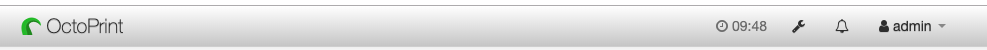
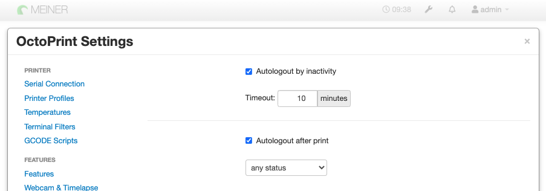

# OctoPrint-AutoLogout

Plugin starts a countdown timer after login and if the timer is count to zero, the user is automatically logged out.
The timer is restarted each time a user clicks on "something" like a tab-change. 

#### Support my Efforts

This plugin, as well as my [other plugins](https://github.com/OllisGit/) were developed in my spare time.
If you like it, I would be thankful about a cup of coffee :) 

## Screenshots

## Setup

Install via the bundled [Plugin Manager](http://docs.octoprint.org/en/master/bundledplugins/pluginmanager.html)
or manually using this URL:

    https://github.com/OllisGit/OctoPrint-AutoLogout/releases/latest/download/master.zip

## Versions

see [Release-Overview](https://github.com/OllisGit/OctoPrint-AutoLogout/releases/)

### Nice looking countdown
http://www.dwuser.com/education/content/easy-javascript-jquery-countdown-clock-builder/
